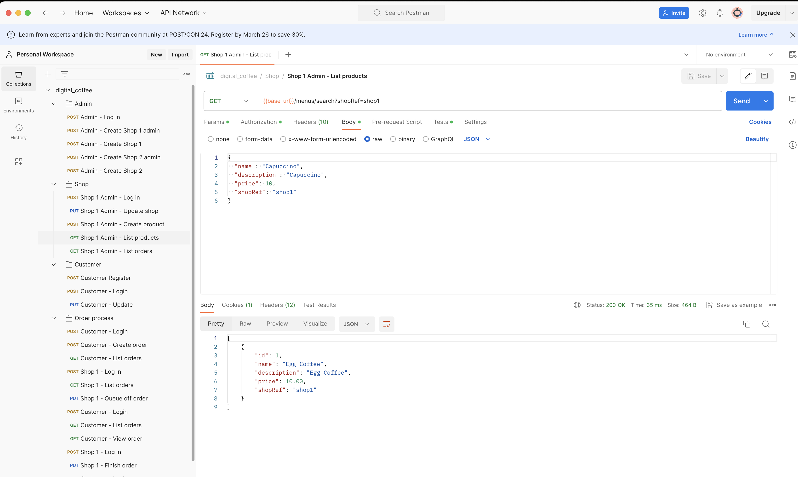
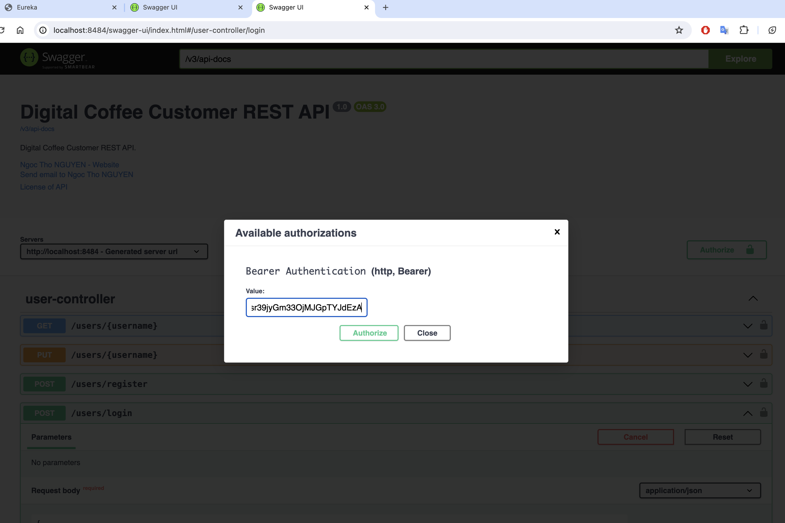

# Digital Coffee

Repository for Digital Coffee platform:
- Eureka discovery service
- API Gateway
- Auth/Users service
- Customer service
- Shop service
- Menu service
- Order service
- Workflow engine
- Notification service
- Commons-lib library

## Solution design
The solution design and other details are outlined in this document: [Solution design](solution-design/README.md)

## Clone source code from Github
```commandline
git clone https://github.com/ngocthonguyen/digital_coffee.git
```

## Build project
```commandline
cd digital_coffee
mvn clean install
```
PS: Docker engine is required because Docker images will be built in the same time.


## Run microservices

### Via Docker compose
```commandline
docker compose up
```

### Via Maven
```commandline
cd ..
mvn spring-boot:run -pl dc-eureka
mvn spring-boot:run -pl dc-api-gateway
mvn spring-boot:run -pl dc-user
mvn spring-boot:run -pl dc-customer
mvn spring-boot:run -pl dc-shop
mvn spring-boot:run -pl dc-order
mvn spring-boot:run -pl dc-menu
```

## Test with Postman
The application can be tested via this Postman collection: [DC_collection](test/digital_coffee.postman_collection.json)


## Test via Swagger UI
It's also possible to test the application via Swagger UI:

[User-service](http://localhost:8484/swagger-ui/index.html)

[Shop-service](http://localhost:8686/swagger-ui/index.html)

[Customer-service](http://localhost:8181/swagger-ui/index.html)

[Menu-service](http://localhost:8585/swagger-ui/index.html)

[Order-service](http://localhost:8282/swagger-ui/index.html)


### Test protected endpoints via swagger
To test protected endpoints via swagger, we need to provide Bear JWT token.
To get a jwt token, we can use users/login endpoint with admin/password.


## TODO
- Add unit and integration tests
- Add data access control
- Use JMS to allow asynch communication between services (ex. notification)
- Use Camunda to manage business process (ex.order process, data change...)
- Add scheduled jobs to clean orphan orders