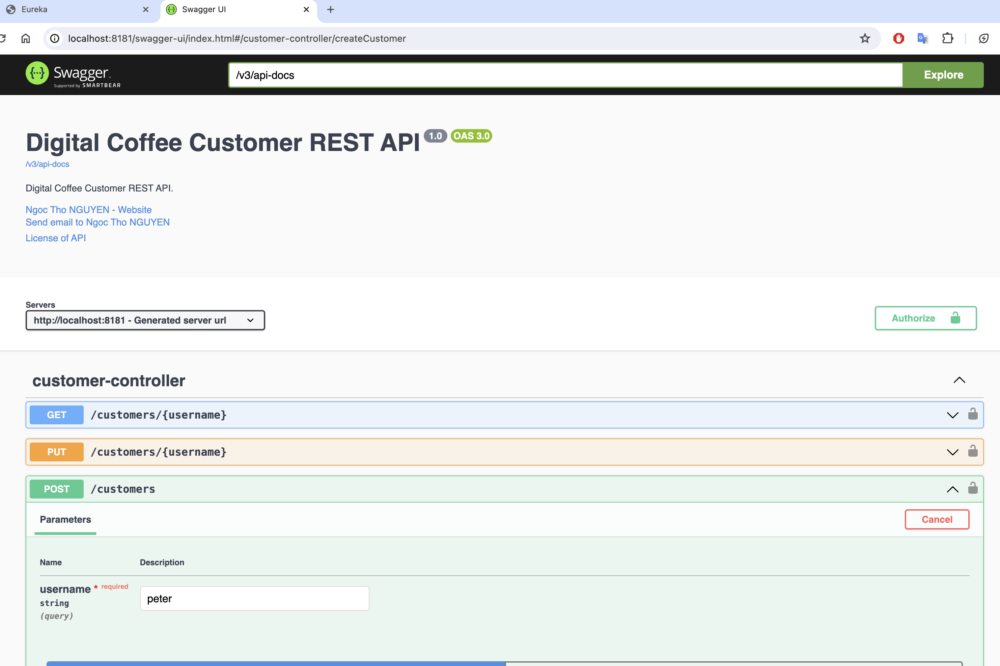

# Digital Coffee

Repository for Digital Coffee platform:
- Eureka discovery service
- API Gateway
- Auth/Users service
- Customer service
- Shop service
- Menu service
- Order service
- Workflow engine
- Notification service
- Commons-lib library

## Solution design
The solution design and other details are outlined in this document: [Solution design](solution-design/README.md)

## Clone source code from Github
```commandline
git clone https://github.com/ngocthonguyen/digital_coffee.git
```

## Build project

### /!\ Docker engine is required since Docker images will be built in the same time.

```commandline
./mvnw clean install
```

## Run microservices on local

### Via Docker compose
```commandline
docker compose up
```

### Via Maven
```commandline
cd ..
mvn spring-boot:run -pl dc-eureka
mvn spring-boot:run -pl dc-api-gateway
mvn spring-boot:run -pl dc-user
mvn spring-boot:run -pl dc-customer
mvn spring-boot:run -pl dc-shop
mvn spring-boot:run -pl dc-order
mvn spring-boot:run -pl dc-menu
```
## Testing

Digital Coffee can be tested via Postman or Swagger UI.
Test scenario:
- Login as Platform Admin with credentials: admin/password (User API)
- Create new user for Shop owner (User API)
- Create Shop (Shop API)
- Login As Shop Owner (User API)
- Update Shop data (Shop API)
- Create Shop menu (Menu API)
- Register as Customer (User API)
- Login as Customer (User API)
- Update Customer data (Customer API)
- Create Order (Order API)
- Login as Shop Operator (User API)
- Pick order from queue (Order API)
- Process / Finish order (Order API)
- Login as Customer (User API)
- Pick up order (Order API)

### Postman
- The application can be tested via this Postman collection: [DC_collection](test/digital_coffee.postman_collection.json)
- Initially the database is empty. Only admin user exists.
- It's necessary to run different steps (mentioned in Test scenario) to create shops, menus, customers and orders


### Swagger UI

Swagger UI is enabled on microservices to facilitate the testing.

As APIs are protected, we need to provide Bear JWT token when testing.
To get jwt token, we can use users/login endpoint with admin/password as credentials.


Swagger UI:

[User-service](http://localhost:8484/swagger-ui/index.html)

[Shop-service](http://localhost:8686/swagger-ui/index.html)

[Customer-service](http://localhost:8181/swagger-ui/index.html)

[Menu-service](http://localhost:8585/swagger-ui/index.html)

[Order-service](http://localhost:8282/swagger-ui/index.html)



## TODO
- Add unit and integration tests
- Fine tune data access control
- Use JMS to allow async communication between services (ex. notification)
- Use Workflow Engine like Camunda to manage business process (ex.order process, data change...)
- Add scheduled jobs to clean orphan orders