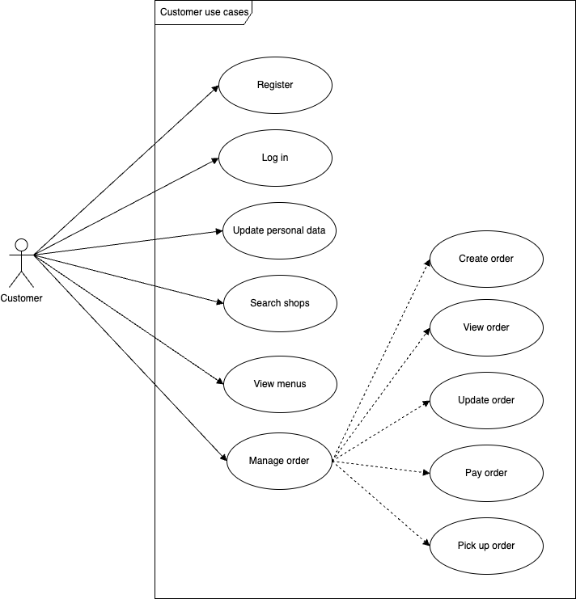
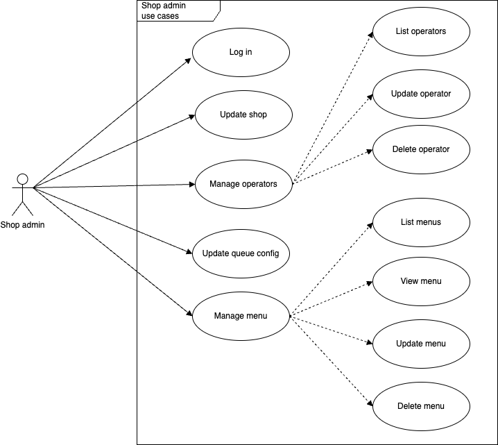

# Solution design for 101Coffee
Solution design documentation for Digital Coffee market place

## Requirements
A global coffee shop chain / franchise intends to launch an app to allow their regular customers to pre-order coffee to pick up (say, on their way to work).
They have identified the following needs:
1. The coffee shop chain is a global network. So, they need to service shop locations across multiple geographies.
2. The space is quite limited. So, they want everything to work easily on an app.
3. They need two apps (a) one for the shop owner and (b) one for the customer
4. They have decided to build (a) on Android and (b) on iOS and Android
5. Not all coffee shops have the same menu. So, they need to be able to handle a
   menu based on the shop
6. Most of their shops have only one queue, but some shops are able to support up to
   3 queues
7. They would like their service to be API enabled, so that others (3rd parties) can
   build apps using their APIs

### The coffee shop app
1. Allows the shop owner to login as an admin user
2. Allows the shop owner to setup / configure the app to support their shop
3. Allows the shop owner to configure the shop / app as follows:
   a. Location and Contact details
   b. The coffee menu & pricing
   c. Number of queues and the maximum size of the queue
   d. opening / closing times
4. Allows the shop operator to login and manage the queue
5. To view / see the size of the queue and the number of waiting customers
6. To easily view the orders placed by the customers in the queue
7. The name of the persons in the queue
8. A score indicating the number of times that customers has been served by the coffee
   shop chain
9. Take a customer off the queue and service them

### The customer app
1. Allows the customer to register with their mobile number, name and regular address (home or work)
2. Allows the customer to view and find the coffee shops closest to them
3. Place an online order for a coffee from the menu
4. See their position in the queue (and expected waiting time before collecting the
   coffee)
5. Exit the queue at any time (and notify the shop to cancel the order)
6. Any other function that you may consider useful

## Use cases

### Customer use cases

### Shop Admin use cases

### Shop operator use cases

## Solution proposal

### Component diagram

## Deployment

Digital Coffe platform will be deployed on AWS

### Deployment diagram

### Security

### Performance

## Implementation

### Create order sequence diagram

### Handle order sequence diagram

## Estimation

## Q&A - Concerns / Remarks