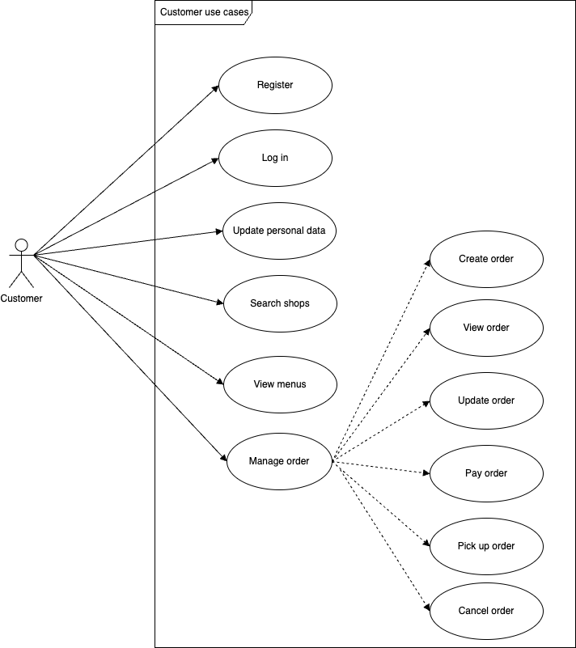

# Solution design for Digital Coffee platform
Solution design documentation for Digital Coffee marketplace.

## Requirements
Requirements are detailed in this document: [Assessment Project - Microservices Engineer v1.3.docx](Assessment%20Project%20-%20Microservices%20Engineer%20v1.3.docx)
## Use cases

### Admin use cases

### Customer use cases

### Shop Admin use cases

### Shop operator use cases

## Solution proposal

### Component diagram

To build Digital Coffee platform, we need to create multiple microservices with different responsibilities:
- Auth service: for user authentication and authorizations
- Shop service: for shop data operations
- Menu service: for menu content operations
- Customer service: for customer data operations
- Order service: for order operations
- Payment service: allowing customers to pay their orders
- Location service: allowing customers to locate shops
- Notification service: to notify customer and shop via different channels (email, push, sms...)

We can also add other technical components like:
- API gateway to be unique entry point for mobile apps
- Discovery service (ex. Netflix Eureka)
- Messaging broker (ex. Solace) to enable async communication between microservices
- Workflow engine (ex. Camunda) to coordinate order processes
- Kibana for logs
- ...

### Tech stack:
- Java 17
- Spring Boot 3
- Spring Security
- OAUTH2
- JWT
- Spring JPA
- Postgres
- Lombok
- Mapstruct
- Flyway
- ...

## Deployment

Microservices are packaged as Docker images, they will be deployed on AWS EKS via helm-charts.
Example of Dockerfile for users service: [Dockerfile](../dc-user/Dockerfile)
- TODO: Publish docker images onto internal Docker registry

### AWS Deployment diagram
TODO

## Security
In order to secure access to Digital coffee platform, it's recommended to adopt a standard authentication/authorization solution like Oauth2 + JWT.

We can also use an opensource solution like Keyclock to handle authentication / authorisations.

## Performance
Digital Coffee is expected to be a world-class marketplace with big number of users and high volume of data. To ensure the performance, we might need to use efficient tools like Regis for distributed cache, Kafka for events, NoSql database... We also need to define automatic scaling plan.

## Implementation

### Order workflow

### Create-order sequence diagram

### Process-order sequence diagram

## Q&A - Concerns / Remarks
- Digital Coffee is expected to be used by 3rd parties. We can use OpenAPI to document our services.